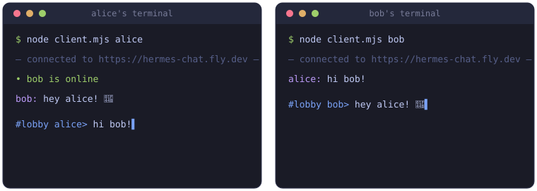
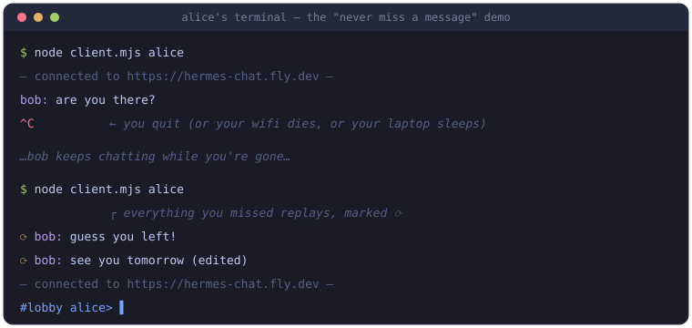
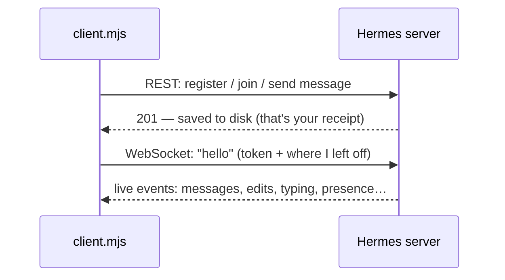

# Hermes chat client

Chat with other people from your terminal — using a single file of JavaScript you can actually read.

This is the official example client for the [Hermes](https://github.com/BrownJ3/hermes) chat server. It's **one file, no installs beyond Node.js**, and it's written to be learned from: every tricky part has a comment explaining *why* it's there.



## What you need

1. **Node.js, version 21 or newer.** Check what you have:

   ```bash
   node --version
   ```

   If that says `command not found` or shows a version below 21, install the "LTS" version from [nodejs.org](https://nodejs.org) — it's a normal installer, next-next-finish.

2. **An invite code** — if the server you're joining is invite-only. Visit the server's `/invite` page (for example `https://hermes-chat.fly.dev/invite`) and fill in the form; the admin will send you a code. You only need it once, the first time you pick a username.

## Step 1 — Get the code

```bash
git clone https://github.com/BrownJ3/hermes-example-client.git
cd hermes-example-client
```

(No `git`? Click the green **Code** button on GitHub → **Download ZIP**, unzip it, and open a terminal in that folder.)

## Step 2 — Start chatting

Replace `alice` with any username you'd like (this creates your account the first time):

```bash
HERMES_URL=https://hermes-chat.fly.dev node client.mjs alice
```

You should see something like:

```
This server is invite-only. Enter your invite code: inv_xxxxxxxxxxxx
— connected to https://hermes-chat.fly.dev —
#lobby alice>
```

That's it — you're in the `#lobby` channel. Type a message and press Enter to send it. Anything other people send appears instantly.

> **Windows note:** the `HERMES_URL=...` prefix works in Git Bash and WSL. In PowerShell use:
> `$env:HERMES_URL="https://hermes-chat.fly.dev"; node client.mjs alice`

## Step 3 — See the "real time" part

Open a **second** terminal and join as someone else:

```bash
HERMES_URL=https://hermes-chat.fly.dev node client.mjs bob
```

Type in one window and watch it appear in the other. You'll also see `• bob is online` presence notices and `… bob is typing` indicators.

## Step 4 — The magic trick: you can't miss a message



Try it yourself:

1. Run two clients (alice and bob), like above.
2. Press **Ctrl-C** in alice's window. She's gone.
3. Send a few messages as bob.
4. Start alice again. The messages she missed replay instantly, marked with `⟳` — including any edits or deletions that happened while she was away.

How? The client remembers a single number per channel (saved in a hidden `.hermes-cursors-alice.json` file) — "the last change I've seen." When it reconnects, it asks the server for everything after that number. That's the whole trick, and it's about 30 lines of [client.mjs](client.mjs). The details live in [PROTOCOL.md](PROTOCOL.md).

## Cheat sheet

| You type | What happens |
|---|---|
| any text + Enter | sends the message |
| `/typing` | shows "… is typing" to others |
| `/quit` or Ctrl-C | leaves (you'll catch up next time) |
| `node client.mjs alice mychannel` | joins (or creates) `#mychannel` instead of `#lobby` |

## When something goes wrong

| You see | What it means |
|---|---|
| `command not found: node` | Node.js isn't installed — see "What you need" above |
| `SyntaxError` mentioning `??` or `import` | your Node is too old — install 21+ |
| `invite_required` | the server needs an invite code — visit its `/invite` page |
| `invalid_invite` | that code was already used or mistyped — codes are single-use |
| `bad_credentials` | that username exists and this password isn't its password — pick a different username |
| `fetch failed` / `ECONNREFUSED` | wrong `HERMES_URL`, or the server is down — try opening the URL in your browser |
| `— disconnected (1001…), retrying —` | the server restarted; the client reconnects by itself, nothing is lost |

## How it works (the 60-second version)

The client only ever does two things:



- **Sending** anything = a normal HTTPS request, like any web API.
- **Receiving** = one WebSocket connection the server pushes events down.

Splitting it this way means you could delete the entire WebSocket half and the client would still *work* (just not live). If you're learning: read [client.mjs](client.mjs) top to bottom (~200 lines, heavily commented), then [PROTOCOL.md](PROTOCOL.md) when you want to build a client of your own in another language.

## License

MIT — copy anything you like.
